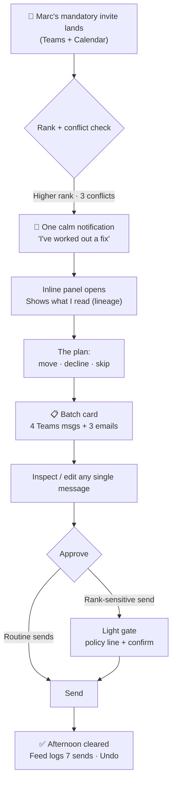

# Jarvis MVP — Visual Story & Prototype Brief

**For:** POC stakeholder presentation · Leadership review (18th)
**Owner:** Pritesh · **Based on:** Project sync (meeting summary) + Alex Kahng's "ideal EA" north star
**Companion docs:** [JARVIS-ONE-PAGER.md](JARVIS-ONE-PAGER.md) · [DESIGN-BRIEF-V3.md](DESIGN-BRIEF-V3.md) · [AMBIENT-FLOW-INTERFACE.md](AMBIENT-FLOW-INTERFACE.md)

---

## 1. The one-sentence pitch

> Jarvis is the **ideal Executive Assistant** for every employee — it watches your inbox and Microsoft Teams, reschedules your day when something more important lands, drafts every polite message for you, and **sends nothing without your one-tap OK.**

Alex's north star, verbatim:

> *"Killer use case is an ideal EA. Sets up meetings, cancels them and adjusts them automatically as new messages from higher-ranking people come in. Sends out polished, polite messages… with seamless orchestration. Keeps the user in the loop for approval of all correspondence (in batch mode — one message to handle 13 threads and unreads). Make it super slick. It should NOT add to the noise. It should NOT be untrustworthy. It should ALWAYS merit your time. Just as a trusted EA would. Make sure it has taste, tactfulness, and a human touch."*

This document turns that north star into a concrete, demoable story scoped to what the MVP will actually ship.

---

## 2. MVP scope — what's in, what's out

Decided in the sync. The visual story stays inside these lines.

| In scope (MVP) | Out of scope (deferred) |
|---|---|
| **Microsoft Teams** (read + send messages on your behalf) | Slack |
| **Email / Outlook** (read + send on your behalf) | WhatsApp |
| **Calendar** — schedule, cancel, **adjust** meetings | Voice / mobile |
| **Comprehension** — read email + Teams to surface what's urgent | Full multi-vendor cross-platform orchestration |
| **Prioritisation** — by keyword **and by sender rank** | |
| **Batch approval** — one message to clear many threads | |

> **Scope translation of Alex's brief:** Alex describes Slack + email + WhatsApp. For the MVP we deliver the *exact same experience* across **Teams + email only.** The batch-approval pattern, the rank-based auto-adjust, the taste and tactfulness — all ship now. The additional channels are a later expansion, not a redesign.

---

## 3. Persona & the EA mental model

**Alex Rivera** — Senior Product Manager at NovaCorp. Lives in Teams and Outlook. Calendar is a battlefield; higher-ranking people drop meetings on it without warning. Today Alex spends ~40 minutes a day rescheduling, apologising, and chasing.

The product promise, in EA terms:

| A great human EA… | Jarvis MVP equivalent |
|---|---|
| Knows who outranks whom and protects your time accordingly | Rank-aware prioritisation (org context + keywords) |
| Reshuffles your calendar quietly when the CEO calls | Auto-drafts the full reshuffle across Teams + email |
| Writes the polite "so sorry to move this" notes | Drafts every message in your voice — tactful, warm |
| Never sends anything embarrassing in your name | **Nothing sends without your approval** |
| Hands you one summary, not 13 interruptions | **Batch approval** — one card, all the threads |
| Earns the interruption every single time | High signal-to-noise; only surfaces what merits you |

---

## 4. Design principles (Alex's brief → concrete UI rules)

These are the bar every screen must clear.

1. **It must merit your time.** No card appears unless it saves more time than it costs to read. The day brief leads with *"I handled 3 overnight. 5 need you, 2 can wait."* — value first.
2. **It must not add to the noise.** Jarvis batches. 13 threads become **one** approval message. No per-action pings. No avatar bubbles. Reads like a document, not a chat log.
3. **It must be trustworthy.** Every drafted message is shown in full before it sends. Every send is logged in the Feed with one-tap **Undo**. Lineage ("here's exactly what I read") is always one tap away.
4. **Taste & tactfulness.** Drafts are warm and human — "So sorry to do this last minute…" not "MEETING CANCELLED." The user can edit any single word before approving.
5. **Human in the loop, always — but lightly.** Low-risk = soft inline confirm. Sending in your name = explicit approval. High-stakes (declining the exec, messaging a VP) = a gate with the policy line spelled out.
6. **Seamless & slick.** One flow, no portal-hopping. Detect → draft → review → approve → done, inside Teams.

---

## 5. The killer use case — "Marc's Mandatory Review"

This is the centerpiece of the POC demo. It exercises every MVP capability in one continuous, slick flow.

**Setup:** It's 11:40 AM. Alex's afternoon is full. A Teams message + calendar invite lands from **Marc (SVP, Product)** — outranks everyone on Alex's afternoon — for a **mandatory product review at 2:00 PM today.** It collides with three things: a 1:1 with Sarah, a sprint sync, and a vendor check-in.

A human EA would quietly fix this and hand you one note. So does Jarvis.

### Storyboard

| # | Scene | What the user sees | Screen / component |
|---|---|---|---|
| 1 | **The interrupt** | A single, calm notification: *"Marc just made a 2 PM product review mandatory. It collides with 3 things on your calendar. I've worked out a fix — want to see it?"* No alarm, no spam. | Notification tray → `triggerProactiveNotif` |
| 2 | **The reasoning** | Alex taps in. Jarvis opens inline (right-side chat panel, not a new tab) and shows **what it read**: Marc's invite, the rank signal, the 3 conflicts — collapsible lineage. | `ChatPanel` + `AgentTrace` (the "here's what I read" accordion) |
| 3 | **The plan** | A clean summary: *"To clear 2 PM for Marc, I'll move your 1:1 with Sarah to 4 PM, decline the vendor check-in with a reschedule offer, and let the sprint sync run without you."* Each line editable. | `ChatPanel` plan summary + `PlanEditor` pattern |
| 4 | **The batch** | **The hero moment.** One card: *"I'm ready to send **4 Teams messages and 3 emails** to make this happen. Take a look before I send."* A table lists every recipient, channel, and the one-line gist. | `MessageTable` + batch `PreviewBlock` |
| 5 | **Inspect & tweak** | Alex expands the note to Sarah, softens one line, leaves the rest. Taste preserved, control retained. | Per-message `PreviewBlock` (edit / send) |
| 6 | **One approval** | Alex taps **Approve all & send.** Because one message declines an SVP-adjacent meeting, that single item shows a light gate with the reason. | `GateModal` (only for the rank-sensitive send) |
| 7 | **Done, reversible** | Toast: *"Sent. Your 2 PM is clear for Marc."* The Feed logs all 7 sends as one grouped entry with **Undo**. | Toast + `FeedView` grouped entry |

### The batch-approval message (MVP copy)

This is Alex's quoted moment, rewritten for MVP scope (Teams + email):

> **🗓️ I've cleared your afternoon for Marc's product review.**
> Before I send, here's everything that goes out in your name:
>
> **4 Teams messages**
> • Sarah — "Can we push our 1:1 to 4 PM? Marc called a mandatory review."
> • Raj — "Going to miss sprint sync — you've got it, notes after?"
> • Priya — heads-up you'll join the review
> • #product-platform — quick FYI you're offline 2–3 PM
>
> **3 emails**
> • Vendor (Acme) — reschedule the check-in, two new slots offered
> • Marc's EA — confirming your attendance
> • Finance — the expense sign-off will land by EOD instead
>
> **Take a look — edit anything, then tap Approve all.**

This is the embodiment of "don't add to the noise": **one message handles seven threads.**

### Flow diagram

---

## 6. The trust contract (silent tiering)

The user never sees "L1/L2/L3/L4." They feel the *right amount of friction at the right time.* (Same model as the One-Pager.)

| Behind the scenes | What the user experiences | In this story |
|---|---|---|
| Autonomous | Just done, logged with Undo | Reading inbox, ranking, drafting |
| Draft → you decide | Shown in full, you Send | The 7 messages |
| Confirm inline | One *Continue?* row | Moving your own 1:1 |
| Gate | Modal + reason + confirm | Declining the rank-sensitive meeting |

**The promise (unchanged):** Every action is logged. Every action is reversible. Anything that affects other people waits for your OK. Jarvis reads signals, not secrets.

---

## 7. Prioritisation — how Jarvis knows what matters

From the sync: filter by **keyword** and by **sender rank.** For the demo:

- **Rank signal:** org hierarchy (Marc = SVP, outranks the afternoon) → auto-reshuffle proposed.
- **Keyword signal:** "mandatory," "urgent," "EOD," "sign-off," customer/exec names → bumps priority.
- **Combined score** drives the morning brief order and the interrupt threshold. Low-signal items wait for the brief; high-signal + high-rank earns a live notification.

---

## 8. Mapping to the existing prototype

Most of this story is already buildable from components in `web/src/App.jsx`. Reuse, don't reinvent.

| Story beat | Already built | To build for the demo |
|---|---|---|
| Inline reasoning panel | `ChatPanel`, `AgentTrace` | — |
| "What I read" lineage | `SourceChips`, trace `bullets` | Add Marc-invite + rank source |
| Tiered actions | `ActionChips`, `PreviewBlock`, `ConfirmRow`, `GateModal` | — |
| Audit trail + Undo | `FeedView`, `FEED_ITEMS`, toast Undo | Add grouped "7 sends" entry |
| Proactive notification | `triggerProactiveNotif`, notif tray | Re-point to the Marc scenario |
| **Batch approval card** | `MessageTable` (table render) | **New: `reschedule` scenario in `CHAT_SCENARIOS` with per-message previews** |

**The one net-new piece** is a `reschedule` chat scenario that renders the batch card (the 4 + 3 message table) with per-row inspect/edit and a single "Approve all & send." Everything else is composition of existing parts.

---

## 9. The two review use cases (for the 18th)

Alongside the killer EA flow, leadership asked for two more priority use cases. These reuse the same shell and trust contract — no new patterns.

1. **HR / incident handling.** An incident or HR case lands; Jarvis assembles context, drafts the response/routing, and gates the sensitive send. (Maps to existing `incident` scenario + `burnout` for the manager view.)
2. **Leave / third-party systems (e.g. leave management).** Multi-system orchestration — file the request, set OOO, draft the handover, nominate a backup — each step tiered. (Maps to the existing `leave` scenario across Workday + Outlook + ServiceNow.)

Both are already prototyped as scenarios; for the 18th they need demo polish and a one-line narrative framing, not new UX.

---

## 10. Demo script (90 seconds)

1. **"Here's Alex's afternoon — packed."** (Today view)
2. **"Marc just made a 2 PM mandatory."** Tap the one notification. (No spam — point this out.)
3. **"Jarvis already worked out the fix — and shows exactly what it read."** Expand lineage.
4. **"One card. Seven messages. Four Teams, three emails."** The batch moment.
5. **"I can edit any of them."** Soften the note to Sarah.
6. **"One tap. Done. And if I change my mind —"** show Feed + Undo.
7. **"That's the ideal EA. It earned the interruption, and it never added to the noise."**

---

## 11. Open questions for the team

- **Send permissions (Mayank):** confirm Jarvis can *write/send* in Teams on the user's behalf — the batch flow depends on it.
- **Rank source:** where does org hierarchy come from for the demo — Workday org chart, or a hardcoded demo map?
- **Approval granularity:** is "Approve all" enough for the POC, or do we also show "approve these 5, hold 2"? (Recommend: keep "Approve all" as the hero, mention per-item hold as a capability.)

---

*Built on Salesforce Agentforce · Microsoft Teams + Email · © 2026 OrgFarm EPIC*
