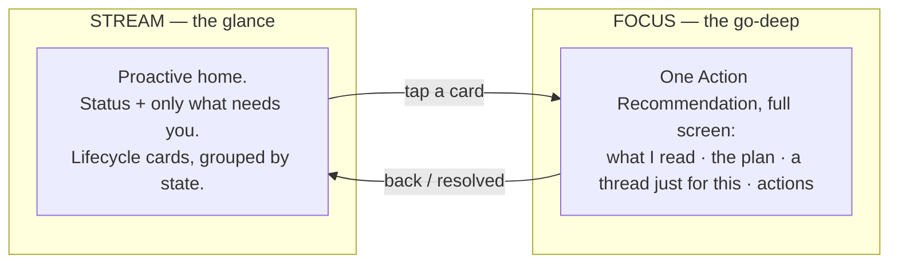
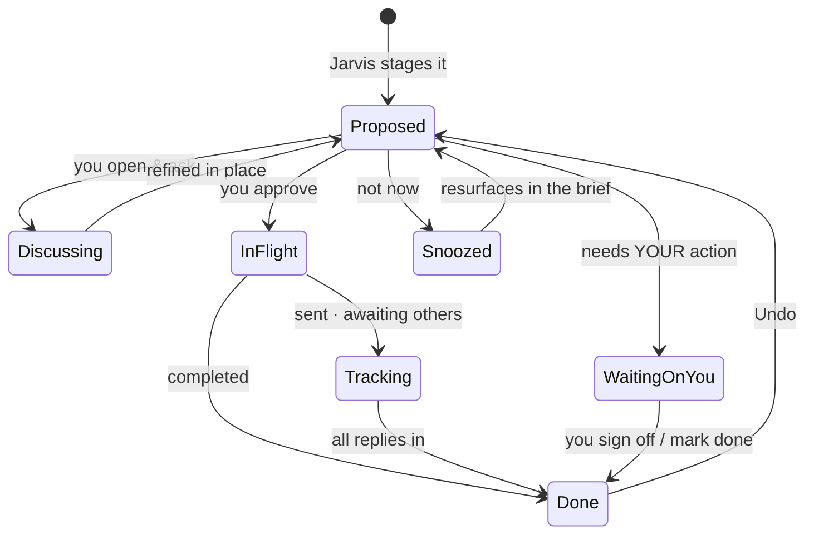

# Concept C — One Living Stream · the full system design

**This is the thought-through version.** The earlier wireframe showed the *resting state* only. This doc designs the whole product: where every piece lives, how an item moves through its life, how you go deep on one thing, how you mark it done, and how it scales on a heavy day.

**Companion prototypes:**
- [`dvs-266-ia-onestream.html`](dvs-266-ia-onestream.html) — **Focus = full takeover** (open an item, discuss it, approve it, mark done, *What I can do*). Best on mobile / Teams / narrow.
- [`dvs-266-ia-onestream-split.html`](dvs-266-ia-onestream-split.html) — **Focus = split** (Stream stays a left rail; the item opens beside it). Best on wide screens — you never lose your place. Collapses to the takeover model under ~880px.

---

## 0. The one rule that makes everything else fall into place

> **There is one object — the Action Recommendation — and two levels of view: the Stream (glance) and Focus (go deep). Skills, Feed, Conversations, Tasks are not separate places; they are facets of that one object.**

Everything below is a consequence of that rule.

---

## 1. Two levels, one object

- **Stream** is home. You live here. It's glanceable and nearly empty at rest.
- **Focus** is where you go deep on exactly one item — read its reasoning, edit its plan, **have a full conversation about it**, and act. It's the *same object* expanding to full screen, not a new tab. Back returns you to the Stream.

This is the email mental model (inbox ⇄ thread), but proactive: the inbox already did the work and is asking for a signature.

---

## 2. The atomic object: an Action Recommendation

Every item — a reschedule, a sign-off, QBR prep, an FYI — is the same object with the same anatomy. That's what kills "too many entry points": one pattern, learned once.

| Part | What it is | Where it shows |
|---|---|---|
| **Headline** | Jarvis's first-person summary ("I cleared 2 PM for Marc") | Stream card + Focus header |
| **State** | Where it is in its life (see §3) | State pill, both levels |
| **Type** | jarvis-action · your-decision · assembled-context · info | Drives which actions appear |
| **What I read** | Lineage + sources (Marc's invite, org rank, 3 conflicts) | Focus (collapsible) |
| **The plan** | The drafts/steps/materials Jarvis assembled | Focus (editable) |
| **Thread** | A conversation *attached to this item* | Focus |
| **Receipt** | Proof after it's done, with Undo | Stream (collapsed) + Focus |

**Why a per-item thread (not one global chat):** people think in *things* — "the Marc thing" — not "the conversation from Tuesday." Attaching the conversation to the object gives **object permanence**: every item is a durable, findable place you can return to, with its own history. The global input bar still exists for "start something new," but most talk happens *inside* the item it's about.

---

## 3. The lifecycle — the full state machine

The earlier sketch only had needs-you → in-flight → done. The real model has the states an EA relationship actually needs:

The two states the sketch was missing — and why they matter:

- **WaitingOnYou** — Jarvis genuinely can't proceed without your judgment (sign-off, a decision only you can make). This is where **"mark done"** lives (§5).
- **Tracking** — Jarvis sent the messages and is now *watching for replies* ("asked Sarah — waiting; I'll nudge at 2"). This is the EA dance Nassan asked for; without it the user wonders "did anything actually happen?" The item stays visible, low-key, until the loop closes.

---

## 4. Where everything lives (the gaps you flagged)

Nothing is homeless. Here's the full IA on one surface:

| Thing | Where it lives in C | Rationale |
|---|---|---|
| **Skills / capabilities** | `✦ What I can do` — top-right panel, **not a tab** | Exactly Nassan's steer. See §6. |
| **Per-item conversation** | The **thread inside Focus** | Talk about a thing, inside the thing. §2 |
| **Mark an item done** | Inline on the card *and* in Focus, for `your-decision` items | §5 |
| **Activity / Feed** | `Handled` group at the bottom of the Stream (collapsed receipts) | Feed = activity; folds in. |
| **History of past items** | **Search** (top-left) + scroll-back; each item is a durable object | Object permanence replaces a "Conversations" tab. |
| **Start something new** | The understated global input bar | Proactive-first: you mostly respond, rarely initiate. |
| **Trust dial** | **Per-skill** in *What I can do*; global default in Settings | A single global dial is too crude. §6 |
| **Autopilot ledger** | `⚡ on autopilot` chip = the "Auto" subset of skills | It's a *view* of skills, not a separate concept. §6 |
| **Notifications (outside app)** | Teams / email / mobile push → deep-link into that item's Focus | The app is a decision surface, not a destination. |
| **Manager view** | Same Stream, manager-grade recommendations (a persona filter) | Not a new IA. Defer until core is trusted. |
| **Settings / connected tools** | `⚙` | Standard. |

---

## 5. Marking done — three completion paths + the payoff

Completion isn't one thing. Three paths, each with the right amount of effort:

1. **Jarvis-completed** (`jarvis-action`): you approve → it executes → it **auto-marks done** and collapses to a receipt. You did nothing extra. *(Marc reschedule.)*
2. **You-completed** (`your-decision`): Jarvis can't verify your judgment, so **you tap "Mark done"** (or "Sign off"). *(Expense exception.)* This is the explicit control the transcript called for — "if this task is done you can just mark it as done."
3. **Auto-resolved** (`tracking`): the loop closes on its own when the last reply lands; Jarvis tells you and it collapses. *(Sarah confirms 4 PM → done.)*

**The payoff — the all-clear moment.** When the last `Needs you` item resolves, the Stream doesn't just go empty; it earns a close: *"You're clear. I'm watching 6 things and will pull you in only if something changes."* This is the peak-end + goal-gradient reward the UX evaluation said the product was missing — the satisfaction of a cleared day, not a blank screen.

---

## 6. Skills, trust, and autopilot — one reconciled system

These three were overlapping and confusing in the current build (Nassan and Subah both flagged it). In C they're **one thing viewed at different depths**:

- **A Skill** = a recurring job Jarvis can do (book rooms, draft status, file training, triage invites).
- **Each skill has a trust level**, set by you, that can ratchet up over time:

| Trust level | Behaviour | Shows up as |
|---|---|---|
| **Ask** | Proposes, waits for approval every time | `Needs you` cards |
| **Draft** | Prepares it, you send | `Needs you` cards (pre-filled) |
| **Auto** | Does it quietly, logs it | `Handled` receipts + the `⚡ autopilot` ledger |

- **`What I can do`** (top-right) is the catalog: every skill, its current trust level, a one-tap change, and "Teach Jarvis something new."
- **The `⚡ on autopilot` chip** is simply the filtered view of skills set to **Auto** — always one tap to pull any back. So "skills," "trust dial," and "autonomy ledger" are the *same data*, not three features.
- **Trust ratchets in-flow:** after you approve the same `Ask` skill several times unchanged, Jarvis offers to promote it to `Auto` right in the Stream ("want me to just handle this?"). Autonomy is *earned visibly*, not configured in a buried settings dial.

---

## 7. Going deep — the per-item conversation (worked example)

From the Stream, you tap **the Marc card** → Focus opens:

1. **Header:** "I cleared 2 PM for Marc's review" · state `Needs you`.
2. **What I read** (collapsible): Marc's invite, the SVP rank signal, the 3 conflicts — each with a source chip.
3. **The plan:** the 7 drafted messages, each editable.
4. **The thread (the part that was missing):** you type *"Offer Sarah Thursday 9 AM instead of today 4 PM."* Jarvis replies *"Done — updated Sarah's message and held Thursday 9 AM,"* and the plan above changes **in place**. You can keep going: *"Why decline Acme rather than move it?"* → Jarvis explains. The whole exchange stays attached to this item.
5. **Act:** `Approve all & send` · or `Snooze` · (for a `your-decision` item it'd be `Mark done`).
6. **Back** → the Stream card now reflects the latest state. The conversation is preserved on the object; reopening it later shows the full history.

This is how C supports "more conversation about a particular intent" without a global chat turning into spaghetti: **the conversation has a home — the item it's about.**

---

## 8. Scale & edges (where a single stream is at risk)

- **Heavy day (12 things need you):** the `Needs you` group sorts by urgency and **clusters similar items** ("3 invites to triage — review together"), and low-priority items fold under "8 more can wait — in your brief." The stream never becomes an unbounded scroll of equal-weight cards.
- **Empty / all-clear:** handled in §5 — relief, not a void. Critical, because a proactive-first UI that's empty must read as "handled," never "broken."
- **Signal quality is the real dependency:** proactive-first lives or dies on Jarvis surfacing the *right* things. An empty-by-default UI is scarier than a dashboard if trust isn't earned — so the validation study must test precisely this (false positives/negatives in what gets surfaced).
- **Bulk control:** `Approve all` exists at the item level (the batch) *and* could exist at the group level for trusted, similar items — but always with per-item visibility first.

---

## 9. Open questions for the brainstorm

- **Focus = full-screen takeover, or split (stream stays as a left rail)?** ~~Open~~ → **both are now built.** Takeover (`onestream.html`) is cleaner on mobile/Teams; split (`onestream-split.html`) preserves context on wide screens and collapses to takeover under 880px. This is exactly where Variants A and B re-enter — they are *this one responsive choice*, not separate architectures. Recommend: ship responsive (split on wide, takeover on narrow).
- **How aggressive is trust-ratcheting?** Auto-promote suggestions are powerful but can feel presumptuous — needs tuning + a clear undo.
- **Per-item threads vs one searchable history:** do we also offer a global "everything you've discussed" search across item threads? (Recommended: yes, search is the history.)
- **Manager view:** same stream + persona filter, or a distinct readiness surface? Defer until the core loop is trusted.

---

## 10. How this answers Nassan, point by point

| Crit point | Concept C answer |
|---|---|
| Too many entry points | One object, one stream, two levels. |
| Kill Today/Conversations/Feed tabs | Gone — status, items, receipts are all the stream. |
| Skills shouldn't be a tab | `What I can do` panel = the skills catalog + trust. |
| Feed ≠ Handled ≠ Skills confusion | Reconciled in §6 — one system, three views. |
| Conversational EA flow + "the dance" | Jarvis-first status + `Tracking` state ("nudge at 2"). |
| Persona / who is "I" | Jarvis is always "I", avatar-tagged; per-item threads make authorship obvious. |
| Intent → Action recommendation | Renamed throughout. |
| What's the true core? | **Trusted delegation with a visible receipt** — the loop in §3, built bulletproof before anything layers on. |

*Built on Salesforce Agentforce · © 2026 OrgFarm EPIC*
