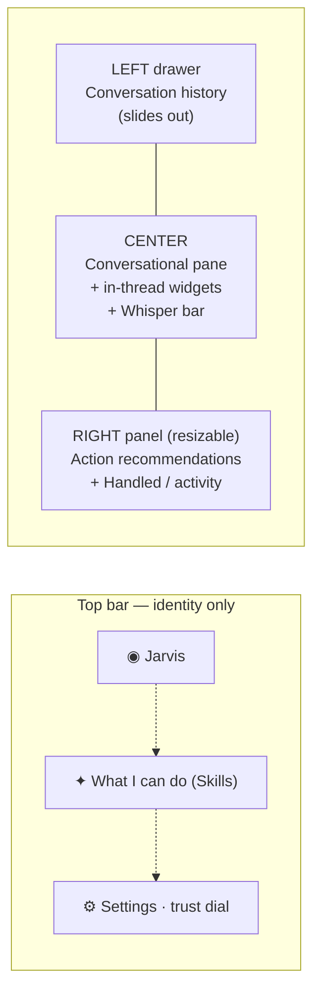

# Jarvis — IA Redesign (post-crit)

**Trigger:** Nassan APAC crit, 17 Jun 2026 · `Nasahn - Open Office hours (APAC Crit)` notes
**Companion wireframes (interactive — press ◆ Crit annotations on each):**
- [`dvs-266-ia-redesign.html`](dvs-266-ia-redesign.html) — **Variant A · right-rail.** History drawer (left) + conversation (center) + action recommendations (right rail). Conversation is the hero.
- [`dvs-266-ia-redesign-left-chat.html`](dvs-266-ia-redesign-left-chat.html) — **Variant B · left-chat / war-room.** Persistent conversation pane (left) drives a large work canvas (right) where recommendations render. Matches the ITSM war-room left-chat pattern.
- [`dvs-266-ia-onestream.html`](dvs-266-ia-onestream.html) — **Concept C · one living stream (proactive-first).** Not a layout tweak — a different interaction model. One collapsible stream of lifecycle cards, Jarvis speaks first, an explicit **in-flight** state, and a growing **autonomy ledger**. Try the interactions: *Approve all & send* (watch one card go needs-you → in-flight → done → undo) and *Yes, stop asking* (autonomy ratchets up).

> **A/B answer the literal feedback. C rethinks the experience.** A and B are *views* of a dashboard, cleaned up. C treats the app as a decision surface you barely open: proactive-first, glanceable at rest, every action-recommendation a self-contained lifecycle object, trust earned visibly over time. See the dedicated POV in §8.
**The one-line steer:** *"Clean up the IA so it isn't tabs + search + chiclets + lists + slideouts. Two panels, like the help portal. The user effortlessly flows through their work."*

---

## 1. What the crit told us

| # | Theme | What Nassan / the room said | Priority |
|---|---|---|---|
| 1 | **Too many entry points** | "Tabs plus search plus chiclets plus lists plus slideouts plus omnipresent — too much stuff all over the place." | P0 |
| 2 | **2-panel, help-portal model** | Conversational pane + dynamic widgets/tiles + contextual, action-oriented info on the right (resizable). History slides from a left drawer. | P0 |
| 3 | **Kill the tabs** | "You don't need a Today tab. You don't need a Conversations tab. You don't need a Feed tab." | P0 |
| 4 | **Skills → not a tab** | "Skills is dope… it becomes almost not a tab — more in settings, upper-right: *what can I do?*" | P1 |
| 5 | **Conversational flow** | "Good morning, I've handled four things overnight" → "what about X?" → "working on it, done by 11:30." The EA dance. | P0 |
| 6 | **Persona / voice** | Unclear who is "I" and who is "you." One coherent first-person storyline, start to end. | P1 |
| 7 | **Feed ≠ Handled ≠ Skills** | These overlap and confuse. Consolidate into one activity stream. | P1 |
| 8 | **Terminology** | **"Intent" → "Action recommendation"** (aligned decision). | P1 (decided) |
| 9 | **Scope / true core** | "You're building an OS — boiling the ocean. What's the *true core*? Do the basic thing really well, earn trust, then layer." | P0 (strategy) |
| 10 | **Chat left vs right** | ITSM war room favored left-hand chat; right was a natural-but-unexamined choice. Open. | Open |

---

## 2. The redesign — one surface, three zones

No tabs. The app is a single conversational workspace with a slide-out history on the left and a contextual action panel on the right.

### Zone-by-zone, and which crit point it answers

**Top bar — identity, not navigation.** Just the Neural Core + name, a `What I can do` affordance (Skills, upper-right), and Settings (where the trust dial and connected tools live). → answers **#3, #4**.

**Left — conversation history drawer.** Collapsed to a thin rail by default; the hamburger slides it out. `New conversation` lives here. This is the *only* place history lives — it is not a tab. → answers **#1, #2, #3**.

**Center — the conversational pane (the core).** Opens on the EA greeting — *"Good morning, Pritesh. I handled 4 things overnight. 5 need you, 2 can wait."* — then a real back-and-forth. Jarvis messages are clearly attributed (avatar + "JARVIS" label, first person); your messages are visually distinct. Heavy actions render as an **in-thread widget** (the Claude/GPT artifact pattern) that updates *in place* rather than repeating the thread. → answers **#2, #5, #6**.

**Right — contextual action panel (resizable).** The omnipresent list, renamed **"Action recommendations"** under a plain-language header (`Needs you · 5`). Below it, **`Handled overnight · 4`** folds the old Feed in as one activity stream with Undo — no separate Feed tab, no separate "handled" filter elsewhere. → answers **#1, #2, #7, #8**.

---

## 3. Old IA → new IA mapping

| Old (multi-tab) | New (one surface) | Why |
|---|---|---|
| **Today** tab | The default state of the center + right panel | "You don't need a Today tab." |
| **Conversations** tab | Left history drawer (slides out) | History is storage, not a destination. |
| **Feed** tab | `Handled / activity` section in the right panel | Feed = activity, folds in. (#7) |
| **Skills** tab | `What I can do` in the upper-right | "More in settings… not even a tab." (#4) |
| **Intent** (cards + concept) | **Action recommendation** | Aligned terminology decision. (#8) |
| Right-side **chat slide-out** | Center *is* the chat; right is for recommendations | Removes the "slideout on top of everything." |
| Manager view (separate shell) | Same surface, manager-grade recommendations | Defer until the core is trusted. (#9) |

---

## 4. Terminology — the single source of truth

| Use this | Not this |
|---|---|
| **Action recommendation** | Intent |
| **Needs you** | Pending / To-do |
| **Handled** (activity) | Feed |
| **What I can do** | Skills (as a tab) |
| **Jarvis** speaks in first person ("I handled…") | Mixed/ambiguous voice |

> Persona rule (fixes #6): **Jarvis is always "I"; the employee is always "you."** Every Jarvis message is avatar-tagged and labeled. The "Handled" count is phrased as Jarvis reporting back ("I handled 4"), never as a neutral system filter.

---

## 5. The "true core" — what we say to the scope concern (#9)

Nassan's strongest point wasn't visual; it was strategic. The recommendation:

- **Core loop (build this bulletproof first):** *Read Outlook + Calendar → surface what needs you → recommend an action → you approve → it's done and logged, reversibly.* That's release 264's actual reach.
- **The trust dance is part of the core**, not a later polish: confirmations, "I'm working on it, done by 11:30," status-back. An EA you don't trust is worthless.
- **Marc's review is more than calendar moves** (Nassan's note): real prep = block an hour before, pull in helpers, gather materials. Frame the reschedule as *step one of preparation*, not the whole job — but **don't build the rest yet.** Name it as the expansion path.
- **Everything else** (cross-vendor orchestration, manager view, multi-channel) is explicitly *layered on after* the core earns trust.

---

## 6. Open question to bring to the brainstorm (#10)

**Where does the conversation live, and where do recommendations render?** Two concrete variants are built — demo both back to back:

| | **Variant A · right-rail** | **Variant B · left-chat / war-room** |
|---|---|---|
| Conversation | Center (hero) | Left column (persistent driver) |
| Recommendations | Right rail (scannable list) | Right canvas (rendered large) |
| Best when | Many items, quick triage | One focused task, "talk → it builds" |
| Heritage | Help-portal model (Nassan) | ITSM war-room left-chat (Shantanu) |
| In-thread widgets | Yes (artifact pattern) | Canvas updates in place via chat |

Decision criteria for the group:
- **Scannability vs focus** — A surfaces more at a glance; B commits to one thing at a time.
- **Consistency** — B aligns with the ITSM war-room pattern already discussed; A aligns with the help portal Nassan referenced. Pick the house pattern.
- **Cognitive load** — test which lowers it for the morning-brief moment.

*Recommendation: prototype both in the React app (per Shantanu's steer — React first, Teams later) and user-test the morning-brief task on each.*

---

## 7. Next steps (from the crit)

- [ ] **[Pritesh]** Share the product strategy / long-term business doc (true core + phasing + business case).
- [ ] **[Group]** Brainstorm session: action-recommendation placement + conversation pane layout + chat left/right.
- [ ] Re-cut the DVS deck/narration to the new terminology and one-surface IA.
- [ ] Validate the consolidated IA against cognitive-load heuristics, then with 5 users.

---

## 8. Beyond the layout debate — the 10x experience POV (Concept C)

A and B clean up the *container*. They don't change the fact that all three (including the current build) are still **"open an app, look at surfaces, process your stuff"** — a dashboard you visit. A real EA isn't a place you go; it **comes to you, having done the work, and asks for a signature.** The goal is to need navigation *almost never*.

### Problems the user still hits in A and B
1. **Split attention** — conversation + recommendations rail + handled = three loci. Burden moved, not removed.
2. **The blank-box tax** — a chat-forward UI quietly says "type a command," contradicting the proactive promise (worst in B).
3. **The missing middle** — A/B show *needs-you* and *handled* but not *in-flight*. Trust is won in the "I'm on it, done by 11:30" gap.
4. **"Did it actually happen?"** — delegation anxiety; the *receipt* is buried in a feed instead of being the hero.
5. **Object permanence** — people think in *things* ("the Marc thing"), not conversations-from-Tuesday or feed rows.
6. **Trust is temporal, the UI is static** — day 1 you check everything; month 3 you want it to just act. No variant expresses the relationship arc.
7. **Mode ambiguity** — command-a-tool vs supervise-an-agent. Users don't know when to wait vs ask.

### The 10x move — one living stream, proactive-first
- **Everything → one collapsible stream.** Recommendation, the chat about it, the sends, "done," and Undo are the *same object* — a lifecycle card that expands when it needs you and collapses to a one-liner when resolved. Kills "two lists" and "where did it go."
- **Jarvis speaks first.** Resting state is never a blank prompt; it's the brief. You spend ~90% of time *responding*, not initiating.
- **Resting state is nearly empty.** A one-line status + the 1–2 things that need you. Everything else one tap deeper.
- **In-flight is first-class** — a live, pulsing "working on it" state. The dance.
- **Autonomy ratchets up, visibly.** Not a static dial — Jarvis earns autonomy item by item ("you approved this 5×, want me to just handle it?") and the growing ledger is always pullable-back.
- **The app is a decision surface, not a destination.** Jarvis reaches you in Teams/email/mobile/voice; pulls you in only for the signature. **Success = less time in the app.**

### Where the category goes
`command a tool → approve an agent's proposals → supervise a colleague that earns autonomy.`
Mostly non-verbal (glance + tap), memory-driven continuity ("last time Sarah preferred mornings"), one mind across every surface, and **the receipt + reversibility as the core product** — proof things happened, not a command console.

### The "true core" (answers Nassan's scope worry directly)
The true core isn't calendar orchestration or an OS. It's **trusted delegation with a visible receipt** — the single loop *read → recommend → you approve → done & logged → reversible.* Build that until it's bulletproof; everything else layers on.

> **Recommendation:** show A as the safe read of the literal feedback, but pitch **Concept C as the direction** — it's the only one that answers "how do we simplify 10x" and "what's the true core" at the same time. A and B then collapse into *views* of C (rail vs canvas), shrinking the layout debate.

---

*Built on Salesforce Agentforce · © 2026 OrgFarm EPIC*
