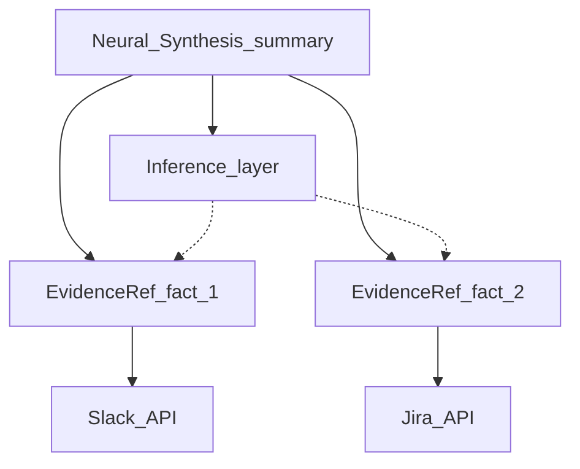

# Backstage logic — lineage mapping and Context Cards

**Goal:** Turn `sources` from **labels** into **evidence** so users can judge suggestions before **Confirm Execution**. Each synthesis claim should trace to **what we read** vs **what we inferred**.

**Related:** Minimum proof by tier → [TRUST-AND-TRANSPARENCY.md](TRUST-AND-TRANSPARENCY.md).

---

## 1. EvidenceRef model

Use one structured object per piece of evidence (store as JSON in app metadata).

| Field | Type | Description |
|-------|------|-------------|
| `id` | string | Stable id for UI keys |
| `system` | enum | Slack, Jira, Workday, GitHub, Datadog, … |
| `objectRef` | string | Ticket id, channel id, doc id, commit sha |
| `snippet` | string | **Quoted** excerpt or numeric fact (short) |
| `capturedAt` | ISO time | When retrieved |
| `kind` | `fact` \| `inference` | Direct read vs derived conclusion |
| `trustLevel` | enum | e.g. verified / stale / partial |
| `permissionScope` | string | What OAuth scope allowed this read |

**Inference rule:** Any paragraph in **Neural Synthesis** that is not a direct quote should link to at least one `fact` EvidenceRef **or** be labeled **Inference** with reasoning scope.

---

## 2. Context Card pattern — “Snippet of Truth” (Negotiation Workspace)

Each card shows **one** EvidenceRef; stack vertically under Synthesis.

| Element | Spec |
|---------|------|
| **Header** | System icon + human label (“Jira · AUTH-204”) |
| **Snippet** | 1–3 lines, monospace or quote style |
| **Freshness** | “Updated 2h ago” or **Stale** badge |
| **Kind pill** | **Fact** (neutral) / **Inference** (muted accent) |
| **Action** | “Open in Jira” deep link when permitted |

**Empty / degraded:** “Source unavailable — reconnect Slack” or “No permission to verify; showing summary only.”

---

## 3. Minimum viable proof by tier

| Tier | Minimum |
|------|---------|
| L1–L2 | Optional link or one-line cite |
| L3 | ≥1 Context Card with **snippet** |
| L4 | ≥2 cards **or** explicit contradiction handling (“Sources disagree: …”) |

---

## 4. Lineage diagram (synthesis → evidence → systems)

---

## 5. Contradictions

If sources conflict, **surface in UI**: two cards side by side + synthesis footnote (“We cannot auto-resolve; pick an assumption or refresh data.”).

---

**Next:** [NEXUS-BUNDLE-AND-CARD.md](NEXUS-BUNDLE-AND-CARD.md).
