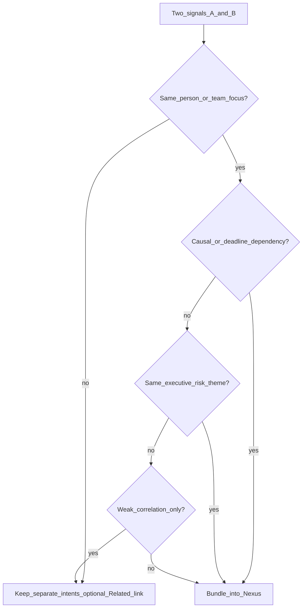

# Nexus system — bundle logic and high-density card

**Goal:** Represent **multi-domain** work (HR + IT + Project) as **one Nexus** without an opaque blob. Reduces **portal fatigue** while keeping each silo visible.

**Related:** Evidence per silo → [LINEAGE-AND-CONTEXT-CARDS.md](LINEAGE-AND-CONTEXT-CARDS.md).

---

## 1. Bundle triggers (when to merge)

Bundle separate signals into **one Nexus intent** when **any** holds:

| Trigger | Example |
|---------|---------|
| **Same actor + same horizon** | Same person, same week |
| **Causal dependency** | Broken laptop **blocks** sprint deliverable |
| **One decision unlocks multiple domains** | Remote-work approval → HR policy + IT kit |
| **Shared risk theme** | “Productivity risk” from overload + hardware + deadline |

---

## 2. Merge vs link (decision tree)

**Weak correlation:** Same user but unrelated topics → **two intents** + “Related” chip, not one Nexus.

---

## 3. Productivity risk example (bundled)

**Signals:** IT — laptop repair delayed; Project — milestone Friday; HR optional — wellness check policy.

**Nexus title:** “Productivity risk: hardware + deadline.”

**Lanes:**

| Silo | Status chip | Next internal step |
|------|-------------|---------------------|
| IT | Replacement in transit | Confirm delivery window |
| Project | At risk if machine late | Align scope or date |
| HR | Optional | Schedule safe check-in |

**Primary user action:** Opens **Negotiation Workspace** with **combined** plan and **per-silo** Context Cards.

---

## 4. Nexus Intent Card — wireframe slots (high density)

| Slot | Content |
|------|---------|
| **A — Headline** | Outcome-focused (“Keep Alex productive this sprint”) |
| **B — Risk / type** | Nexus vs Critical vs Retention |
| **C — Silo row** | IT · HR · Project — each: status dot + one word |
| **D — Progress** | Combined step bar OR checklist across silos |
| **E — Proof** | 1–2 Context Cards proving why bundle exists |
| **F — CTA** | “Review Nexus” → Workspace |

**Density hierarchy:** Headline → silo health → shared next step → proof → CTA.

---

## 5. Escalation path

If one silo **blocks** others, show **blocker** icon on that lane first; CTA text reflects unblock (“Confirm expedited ship” / “Slip milestone”).

---

**Next:** [PERSONA-INTENT-BLUEPRINTS.md](PERSONA-INTENT-BLUEPRINTS.md).
