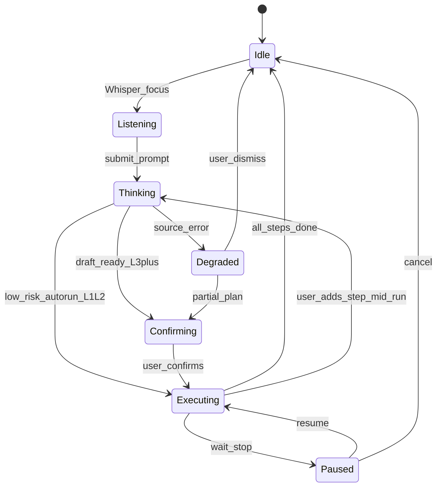

# Intent taxonomy and grammar — Whisper Bar

**Goal:** **Unambiguous** natural language for **execution control** so “Wait” always maps to one machine behavior. Extends the stub `handleSend` pattern in `web/src/App.jsx` to a full contract.

**Related:** Risk and confirm levels → [TRUST-AND-TRANSPARENCY.md](TRUST-AND-TRANSPARENCY.md).

---

## 1. Command grammar layers

| Layer | Scope | Examples |
|-------|--------|----------|
| **Discourse** | Whole intent: pause, resume, cancel | “Stop,” “resume,” “cancel this intent” |
| **Plan** | Steps: add, remove, reorder, delay | “Remove step 2,” “run that after 3pm” |
| **Meta** | Explain; no execution | “Why,” “show sources,” “what did you read” |

---

## 2. Disambiguation — verbs that look alike

| Phrase | If `executing` | If `negotiating` (workspace open) | If `staged` only |
|--------|----------------|--------------------------------------|------------------|
| **Wait / hold** | **Pause after current step** | Do not start execution until user says **resume** | Hold plan; no run |
| **Stop** | Pause → state **paused** | Same | Same |
| **Cancel** | Abandon intent (confirm L3+) | Close without execute | Dismiss draft |
| **Undo** | Revert last **completed** user-visible op if within window | Revert last plan edit | — |
| **Skip** | Mark current or named step skipped (policy check) | Mark step skipped | — |

**Two active intents:** Always scope by **focus** (last touched card or explicit “this one: …”); if unclear, **clarify** once.

---

## 3. Phrase library v0 (for product + eng)

| Phrase / pattern | Intent class | Required context | Action on `currentSteps` / lifecycle | If unclear, ask |
|------------------|--------------|------------------|--------------------------------------|-----------------|
| “open review” / “show plan” | Navigate | Intent selected | Set lifecycle → **negotiating**; open Workspace | Which intent? |
| “add step …” | Plan edit | Intent in negotiating | Append step; mark user-added | Where to insert? |
| “remove step …” | Plan edit | Negotiating | Remove or mark **skipped** by id/index | Which step? |
| “move … before …” | Plan edit | Negotiating | Reorder | Confirm positions |
| “delay … until …” | Plan edit | Negotiating | Attach schedule constraint or reorder | Time zone? |
| “why” / “explain” | Meta | Any | Scroll to Synthesis + lineage | — |
| “confirm” / “go ahead” | Execute | Policy allows; L3+ gates satisfied | **executing** | Echo action for L3+ |
| “wait” / “hold” | Discourse | See §2 | Pause per table | — |
| “cancel” | Discourse | — | **cancelled** / archived | Confirm for L3+ |

---

## 4. Whisper Bar modes

| Mode | Behavior |
|------|----------|
| **Query** | Answer or fetch context; no mutation unless user confirms in a follow-up |
| **Command** | Parse phrase library; mutate plan or lifecycle |

Switch modes via intent (implicit: verbs like “add/remove”) or UI toggle if needed.

---

## 5. High-risk confirmation

- **L3–L4:** Echo concrete nouns (“Deploy **auth-service** to **prod**?”).
- **L4:** Two-step confirm or typed token; never accept vague “ok” alone.

---

## 6. State diagram — Whisper, Workspace, execution

---

**Next:** [LINEAGE-AND-CONTEXT-CARDS.md](LINEAGE-AND-CONTEXT-CARDS.md).
